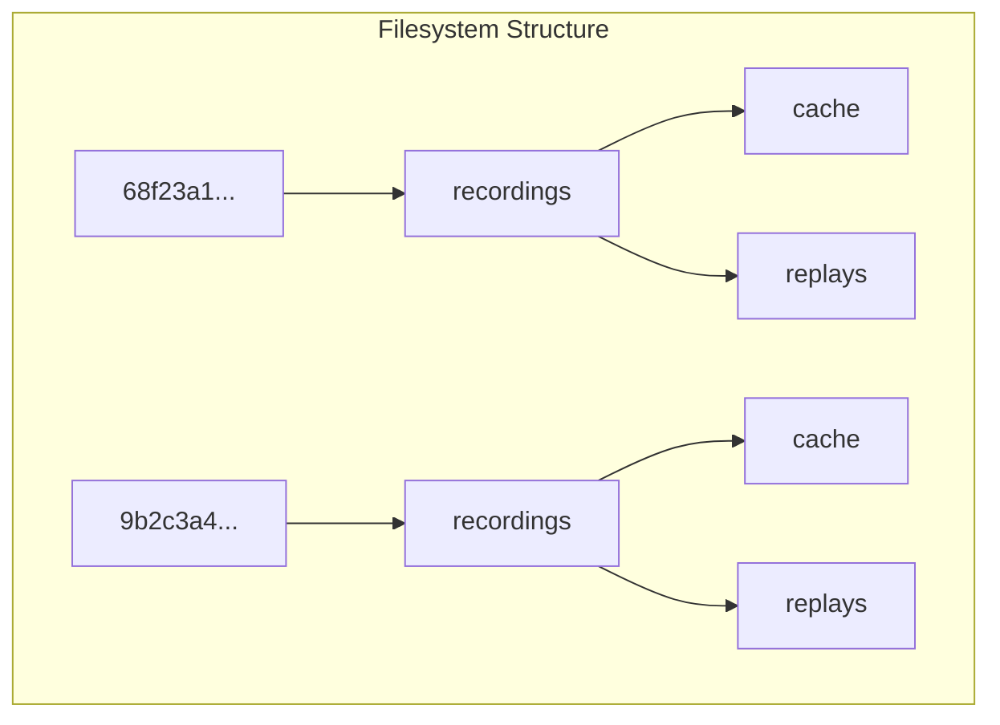

# UUID Identification & Nested Storage

I've updated the system to use full UUIDs for identification and to organize recordings into session-specific nested folders.

## Changes Made

### 1. Full UUID Identifiers
The server now uses the full `uuid4()` string for client identification. This ensures that every client has a truly unique ID, even in large or long-running networks.

- **Check it in:** [server.py](file:///c:/Users/Deniz/Desktop/6064/server.py#L43)

### 2. Session-Specific Recording Folders
Each client now generates its own `session_uuid` when it starts. This UUID is used to create a isolated directory for that specific run of the client.

The new folder structure is:
- `<session_uuid>/recordings/cache/` (temporary segments)
- `<session_uuid>/recordings/replays/` (final stitched videos)

This means you can run many clients on the same machine without them ever touching each other's files.

- **Check it in:** [client.py](file:///c:/Users/Deniz/Desktop/6064/client.py#L106-112)
- **Check it in:** [replay_recorder.py](file:///c:/Users/Deniz/Desktop/6064/custommodules/replay_recorder.py#L20-31)

### 3. Flexible Identification
The server now tracks three different ways to identify a client:
1.  **Full UUID:** For absolute uniqueness.
2.  **Short ID:** The first 8 characters (the "old" system legacy).
3.  **IP Address:** The network address of the client.

You can now use any of these in server commands like `/savescreen <target>`.

## How to use

1. Start the server:
   ```bash
   python server.py
   ```
2. Start one or more clients:
   ```bash
   python client.py
   ```
   *Each client will display its unique Session UUID in the header.*
3. On the server, type `/clients` to see the full UUIDs.
4. Type `/savescreen <uuid>` to trigger a save for a specific client.
5. Check the folder on your disk — you will see a folder named after the UUID containing the `recordings`.


